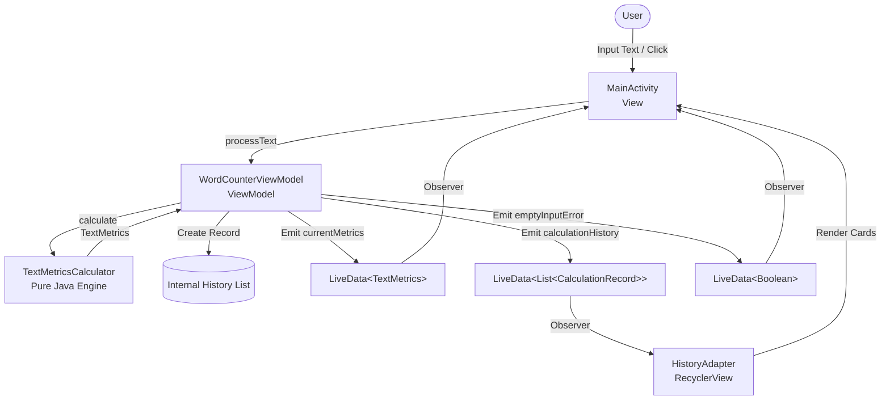

# MADT Lab #2: Word Counter

An Android application developed for Mobile Application Development Technologies (MADT) Lab #2. Word Counter provides comprehensive, real-time linguistic and structural text analysis, calculating sentences, words, punctuation marks, and numbers. Built using modern Android development practices, MVVM architecture, Material Design 3, View Binding, and a headless, framework-independent calculation engine.

---

## Table of Contents

1. [Project Overview](#project-overview)
2. [Main Features](#main-features)
3. [Calculated Metrics](#calculated-metrics)
4. [Test Sentence Generation](#test-sentence-generation)
5. [Calculation History](#calculation-history)
6. [Empty Input Validation](#empty-input-validation)
7. [Reusable Metric Calculation Engine](#reusable-metric-calculation-engine)
8. [Localization & GUI Strings](#localization--gui-strings)
9. [Architecture & Project Structure](#architecture--project-structure)
10. [Building and Running the Application](#building-and-running-the-application)
11. [Running Unit Tests](#running-unit-tests)
12. [Unit Test Results](#unit-test-results)
13. [Debug APK Build Result](#debug-apk-build-result)

---

## Project Overview

* **Application Name:** Word Counter
* **Package Identifier:** `com.madt.lab2.wordcounter`
* **Target Platform:** Android (Min SDK: 24, Target SDK: 37, Compile SDK: 37)
* **Architecture:** Model-View-ViewModel (MVVM) with Android Architecture Components (`ViewModel`, `LiveData`)
* **UI Framework:** Android Material Components (Material Design 3, ViewBinding, CoordinatorLayout, RecyclerView)
* **Language:** Java 11

The goal of this laboratory work is to construct a robust Android application that analyzes user-supplied text and computes four foundational metrics: sentence count, word count, punctuation count, and number count. The business logic is decoupled from Android UI classes to ensure testability, reusability, and architectural maintainability.

---

## Main Features

* **Multi-Metric Text Analysis:** Instantaneous calculation of 4 distinct linguistic metrics across single or multi-line text inputs.
* **Test Sentence Generator:** One-tap insertion of curated sample sentences to quickly evaluate various edge cases (decimals, Unicode, hyphens, abbreviations).
* **Runtime Calculation History:** Dynamic log of all analyses performed during the current session, complete with timestamps and metric breakdowns.
* **Interactive History Recall:** Tapping any past calculation item in the history list instantly restores that text into the input field for re-evaluation.
* **Robust Input Validation:** Visual and tactile warnings (`TextInputLayout` error state and Toast alerts) preventing empty or whitespace-only submissions.
* **Responsive State Management:** Preserves inputs, results, and runtime history across configuration changes (e.g., screen orientation changes) via Android `ViewModel`.
* **State Reset Actions:** Dedicated options to clear current input/metrics or wipe the runtime calculation history.
* **Pure Java Calculation Engine:** Zero dependency on `android.*` APIs within the core counting algorithms, enabling fast JVM unit testing.
* **Fully Localizable Resources:** 100% of UI labels, prompts, error messages, and format strings are abstracted into Android resource files (`res/values/strings.xml`).

---

## Calculated Metrics

The application accurately identifies and computes four metrics:

| Metric | Calculator Method | Detection Method & Rules |
| :--- | :--- | :--- |
| **Sentences** | `TextMetricsCalculator.countSentences()` | Standard Java `BreakIterator.getSentenceInstance(Locale.getDefault())`. Validates that each segment contains at least one alphanumeric character to avoid counting empty punctuation sequences. Supports fallback for single sentences lacking terminal punctuation. |
| **Words** | `TextMetricsCalculator.countWords()` | Regex: `(?U)\b(?=[^\s]*?\p{L})[\p{L}\p{N}]+(?:['’\p{Pd}][\p{L}\p{N}]+)*\b`. Supports Unicode alphabets (e.g. Lithuanian `ąžuolas`, French `délicieux`), alphanumeric tokens (`Lab2`), contractions (`it's`), and hyphenated words (`state-of-the-art`, `COVID-19`). Pure numeric tokens are excluded. |
| **Punctuation Marks** | `TextMetricsCalculator.countPunctuation()` | Regex: `[\p{Punct}\p{P}]`. Accurately counts all ASCII punctuation and Unicode punctuation characters (`.`, `,`, `!`, `?`, `;`, `:`, `'`, `"`, `-`, `—`, etc.), including marks inside formatted numbers and contractions. |
| **Numbers** | `TextMetricsCalculator.countNumbers()` | Regex: `\b\d+(?:[.,]\d+)*\b`. Detects standalone integers (`42`, `2026`), floating-point values (`3.14`), currency amounts (`15.50`), and formatted values with thousand separators (`1,000`, `1,000,000`). |

---

## Test Sentence Generation

To facilitate rapid verification without manual typing, the application features an integrated sample generator:

* **Trigger:** "Generate Sample" button (`btnGenerateSample`).
* **Source:** String array resource `@array/sample_sentences` in `strings.xml`.
* **Anti-Repeat Selection:** An algorithmic check ensures that pressing the button repeatedly cycles through different samples rather than picking the same item consecutively.
* **Curated Test Cases:**
  1. `"The quick brown fox jumps over the lazy dog."` — Clean single sentence with standard English words.
  2. `"In 2026, Lab #2 costs $15.50 for 3 students. Is it worth it? Yes!"` — Multiple sentences, formatted numbers, currency symbols, and mixed punctuation (`#`, `$`, `?`, `!`).
  3. `"Java and Android development are powerful, modern, and reliable!"` — Multi-clause sentence with Oxford commas and exclamation point.
  4. `"Dr. Smith bought 5 apples, 12 oranges, and 3.14 liters of juice."` — Title abbreviation period (`Dr.`), integer counts, and floating-point decimal (`3.14`).
  5. `"Wait… Is that really 100% true?! Yes, absolutely."` — Ellipses, percentage signs, combined punctuation (`?!`), and multiple sentences.
* **User Feedback:** Automatically sets focus to the input box, places the cursor at the end of the text, and presents a brief confirmation Toast (`toast_sample_generated`).

---

## Calculation History

The application maintains an in-memory audit log of all calculations conducted within the current session:

* **Record Model (`CalculationRecord`):**
  * `id`: Unique timestamp ID (`System.currentTimeMillis()`).
  * `inputText`: Full text supplied for the calculation.
  * `timestampFormatted`: Formatted execution time (`HH:mm:ss`).
  * `metrics`: Immutable `TextMetrics` result containing all 4 counts.
  * `snippet`: 140-character normalized preview string for clean list rendering.
* **Presentation:** Displayed via an Android `RecyclerView` using `HistoryAdapter` and custom cards (`item_calculation_history.xml`).
* **Chronological Ordering:** Newest calculations are automatically prepended to the top of the list (`index 0`).
* **Interaction:** Tapping any card in the calculation history copies the record's full input text back into the input field for instant re-use or editing.
* **Session Persistence:** Retained across screen rotations and configuration changes within `WordCounterViewModel`.
* **Clear History Action:** Dedicated "Clear History" button (`btnClearHistory`) resets the list and restores the empty state placeholder (`tvEmptyHistory`).

---

## Empty Input Validation

To ensure calculation integrity and guide user interaction:

* **Validation Rules:** Inputs that are `null`, empty, or contain only whitespace characters are rejected by `WordCounterViewModel.processText()`.
* **Error Indication:**
  * The `TextInputLayout` enters an error state displaying `"Input cannot be empty. Please enter or generate text."`.
  * An explanatory Toast alert is shown.
  * Current metric counters are zeroed out (`TextMetrics.empty()`).
  * Empty submissions are **not** appended to the calculation history.
* **Dynamic Reset:** A `TextWatcher` on the input field monitors keystrokes and immediately clears the error state (`viewModel.clearInputError()`) as soon as the user starts typing.

---

## Reusable Metric Calculation Engine

The calculation engine is isolated in `com.madt.lab2.wordcounter.util.TextMetricsCalculator`.

### Design Highlights:
* **Zero Framework Coupling:** Completely free of `android.*` dependencies. It relies exclusively on standard Java packages (`java.text.BreakIterator`, `java.util.regex.*`, `java.util.Locale`).
* **Immutability:** Results are encapsulated in `com.madt.lab2.wordcounter.model.TextMetrics`, which provides immutable integer getters and value-object semantics (`equals()`, `hashCode()`, `toString()`).
* **Headless Unit Testing:** Because the class has no Android dependencies, test suites run directly on the host JVM in milliseconds without requiring Robolectric, Android instrumentation, or physical devices/emulators.
* **Thread Safety:** Implemented as a final utility class with a private constructor and stateless public static methods.

---

## Localization & GUI Strings

All user-visible interface strings are centralized in `app/src/main/res/values/strings.xml`. No hardcoded strings exist in layouts or Java source files.

```xml
<resources>
    <!-- Application and Screen Titles -->
    <string name="app_name">Word Counter</string>
    <string name="toolbar_title">MADT Word Counter</string>

    <!-- Input Section -->
    <string name="input_label">Text to Analyze</string>
    <string name="input_hint">Enter or paste your text here…</string>
    <string name="btn_calculate">Calculate Metrics</string>
    <string name="btn_generate_sample">Generate Sample</string>
    <string name="btn_clear_input">Clear Text</string>

    <!-- Error and Feedback Notifications -->
    <string name="error_empty_input">Input cannot be empty. Please enter or generate text.</string>
    <string name="toast_sample_generated">Sample sentence inserted.</string>
    <string name="toast_history_cleared">Calculation history cleared.</string>
    <string name="toast_metrics_cleared">Input and metrics cleared.</string>

    <!-- Metrics Card -->
    <string name="label_current_metrics">Current Analysis</string>
    <string name="metric_sentences_format">Sentences: %1$d</string>
    <string name="metric_words_format">Words: %1$d</string>
    <string name="metric_punctuation_format">Punctuation: %1$d</string>
    <string name="metric_numbers_format">Numbers: %1$d</string>

    <!-- History Section -->
    <string name="label_history">Calculation History (Current Runtime)</string>
    <string name="btn_clear_history">Clear History</string>
    <string name="history_empty_message">No calculations recorded yet in this session.</string>
    <string name="history_item_time_format">Calculated at %1$s</string>
    <string name="history_item_metrics_summary">Sentences: %1$d  •  Words: %2$d  •  Punctuation: %3$d  •  Numbers: %4$d</string>
    <string name="action_copy_snippet">Copy to input</string>
    <string name="toast_copied_to_input">Text copied to input field.</string>

    <!-- Sample Sentences for Generation -->
    <string-array name="sample_sentences">
        <item>The quick brown fox jumps over the lazy dog.</item>
        <item>In 2026, Lab #2 costs $15.50 for 3 students. Is it worth it? Yes!</item>
        <item>Java and Android development are powerful, modern, and reliable!</item>
        <item>Dr. Smith bought 5 apples, 12 oranges, and 3.14 liters of juice.</item>
        <item>Wait… Is that really 100% true?! Yes, absolutely.</item>
    </string-array>
</resources>
```

---

## Architecture & Project Structure

The project follows the MVVM (Model-View-ViewModel) architectural pattern:

```
app/src/main/
├── AndroidManifest.xml
├── java/com/madt/lab2/wordcounter/
│   ├── MainActivity.java                    # View layer: Activity managing UI events & observing LiveData
│   ├── adapter/
│   │   └── HistoryAdapter.java              # View layer: RecyclerView adapter for history cards
│   ├── model/
│   │   ├── CalculationRecord.java           # Model: Runtime history entry with timestamp & text
│   │   └── TextMetrics.java                 # Model: Immutable metric count container
│   ├── util/
│   │   └── TextMetricsCalculator.java       # Utility: Pure Java regex & BreakIterator metric engine
│   └── viewmodel/
│       └── WordCounterViewModel.java        # ViewModel: Retains state & exposes LiveData streams
└── res/
    ├── layout/
    │   ├── activity_main.xml                # Main screen layout with Material Cards & RecyclerView
    │   └── item_calculation_history.xml    # History item card layout
    └── values/
        ├── colors.xml                       # Theme color definitions
        ├── strings.xml                      # Localized string resources & sample sentences
        └── themes.xml                       # Application Material 3 theme styling
```

### Architectural Data Flow



---

## Building and Running the Application

### Prerequisites

* **JDK:** Java 11 or higher (or the embedded JBR from Android Studio).
* **Android SDK:** Installed with build-tools and platform SDK (API 34+ / API 37 recommended).
* **Environment Variable:** Ensure `JAVA_HOME` points to your JDK / JBR directory.

### Build Commands

Using the Gradle wrapper from the root of the project:

```powershell
# Set JAVA_HOME if not configured globally (example using Android Studio bundled JBR on Windows)
$env:JAVA_HOME = "C:\Program Files\Android\Android Studio\jbr"

# Assemble Debug APK
.\gradlew.bat assembleDebug
```

On Linux or macOS:
```bash
./gradlew assembleDebug
```

### Installing and Running

1. **Via Gradle to connected device/emulator:**
   ```powershell
   .\gradlew.bat installDebug
   ```
2. **Via Android Debug Bridge (`adb`):**
   ```powershell
   adb install app\build\outputs\apk\debug\app-debug.apk
   ```
3. **Via Android Studio:**
   * Open Android Studio.
   * Select **Open an Existing Project** and choose the `WordCounter` directory.
   * Wait for Gradle sync to complete.
   * Select a target emulator or physical device from the device toolbar.
   * Click **Run 'app'** (`Shift + F10`).

---

## Running Unit Tests

To run the full suite of JVM unit tests:

```powershell
# Windows
$env:JAVA_HOME = "C:\Program Files\Android\Android Studio\jbr"
.\gradlew.bat test
```

On Linux or macOS:
```bash
./gradlew test
```

### Test Artifact Locations

* **HTML Summary Report:** `app/build/reports/tests/testDebugUnitTest/index.html`
* **XML Test Result Data:** `app/build/test-results/testDebugUnitTest/`

---

## Unit Test Results

The test suite contains 17 comprehensive unit tests verifying the calculation engine and MVVM ViewModel behavior under standard, complex, and edge-case conditions. All tests pass with 100% success rate.

### `TextMetricsCalculatorTest` (11 Tests)

| # | Test Method Name | Description & Verification | Status |
| :---: | :--- | :--- | :---: |
| 1 | `testNullInputReturnsZeroMetrics` | Confirms `null` input safely yields all zero counts without throwing `NullPointerException`. | **PASSED** |
| 2 | `testEmptyAndWhitespaceInputReturnsZeroMetrics` | Confirms spaces, tabs, and newlines return zero metrics. | **PASSED** |
| 3 | `testSimpleSentence` | Verifies counting for `"The quick brown fox jumps over the lazy dog."` (1 sentence, 9 words, 1 punct, 0 numbers). | **PASSED** |
| 4 | `testNumbersAndDecimals` | Evaluates `"Room 402 costs 3.50 dollars."` (1 sentence, 3 words, 2 punct, 2 numbers). | **PASSED** |
| 5 | `testMultipleSentencesWithDifferentPunctuation` | Evaluates `"Hello world! How are you doing today? I am fine."` (3 sentences, 10 words, 3 punct, 0 numbers). | **PASSED** |
| 6 | `testContractionsAndHyphenatedWords` | Evaluates `"It's a state-of-the-art laboratory in 2026."` verifying words with apostrophes and hyphens. | **PASSED** |
| 7 | `testMultiplePunctuationMarks` | Evaluates `"Really?! That is amazing..."` checking punctuation clustering (`?!`, `...`). | **PASSED** |
| 8 | `testSentenceWithoutEndingPeriod` | Verifies headline sentence detection lacking terminal punctuation (`"Just a headline with no period"`). | **PASSED** |
| 9 | `testUnicodeWordsLithuanianAndFrench` | Verifies non-ASCII Unicode word extraction: Lithuanian (`"Ąžuolas auga miške."`) and French (`"C'est un café délicieux!"`). | **PASSED** |
| 10 | `testFormattedNumbersWithThousandSeparators` | Evaluates formatted numbers (`"1,000,000"`, `"1,000.50"`) ensuring proper number classification. | **PASSED** |
| 11 | `testAlphanumericWordsAndIdentifiers` | Verifies token `"Lab2"` is recognized as an alphanumeric word while `"402"` and `"2026"` are numbers. | **PASSED** |

### `WordCounterViewModelTest` (6 Tests)

| # | Test Method Name | Description & Verification | Status |
| :---: | :--- | :--- | :---: |
| 1 | `testInitialState` | Verifies default zero metrics, empty history list, and false validation error state. | **PASSED** |
| 2 | `testEmptyInputValidationSetsErrorAndResetsMetrics` | Asserts whitespace input triggers `emptyInputError=true`, resets metrics, and suppresses history insertion. | **PASSED** |
| 3 | `testValidInputUpdatesMetricsAndHistory` | Verifies valid input updates LiveData metrics and appends a `CalculationRecord` to history. | **PASSED** |
| 4 | `testClearHistoryAndResetMetrics` | Verifies `clearHistory()` and `resetCurrentMetrics()` correctly flush state. | **PASSED** |
| 5 | `testEmptyInputAfterValidCalculationResetsMetrics` | Confirms subsequent empty submission resets previous metrics to zero. | **PASSED** |
| 6 | `testClearInputError` | Asserts typing action clears validation error flag via `clearInputError()`. | **PASSED** |

**Summary:** 17 tests executed, 17 succeeded, 0 failed, 0 skipped.

---

## Debug APK Build Result

The debug APK has been successfully compiled and packaged:

* **Task Status:** `BUILD SUCCESSFUL`
* **File Name:** `app-debug.apk`
* **Relative Path:** `app/build/outputs/apk/debug/app-debug.apk`
* **Absolute Path:** `C:\Users\murad\.gemini\antigravity\scratch\WordCounter\app\build\outputs\apk\debug\app-debug.apk`
* **File Size:** `5,728,711 bytes (~5.46 MB)`
* **Package Name:** `com.madt.lab2.wordcounter`
* **Min SDK:** 24 (Android 7.0 Nougat)
* **Target SDK:** 37
* **Version Code:** `1`
* **Version Name:** `1.0`
